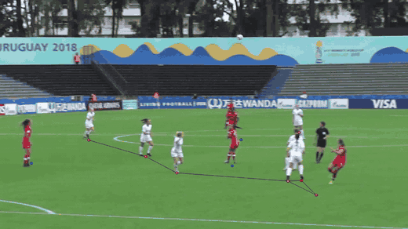

# VisionPitch AI

[](https://github.com/ahmedsayed1911/VisionPitch-AI/actions/workflows/tests.yml)
[](pyproject.toml)
[](LICENSE)

**AI-powered football tactical analysis using Computer Vision.**

VisionPitch AI turns an ordinary broadcast match video into structured tactical
data. It detects players, goalkeepers, referees and the ball, tracks them
through camera motion, works out which team each player belongs to, calibrates
the pitch into real-world metres, and renders the resulting tactical structure
back over the untouched broadcast frame.

Nothing is entered by hand. Teams, kit colours, goalkeepers, attacking
directions and squad sizes are all inferred from the video itself.

```bash
visionpitch analyse match.mp4 --mode balanced
```

<p align="center">
  
</p>

<p align="center">
  <sub>Showcase render on a CC BY-SA 4.0 clip (2018 FIFA U-17 Women's World Cup,
  New Zealand vs Canada, by NaBUru38 via Wikimedia Commons).
  See <a href="docs/media/ATTRIBUTION.md">docs/media/ATTRIBUTION.md</a>.</sub>
</p>

---

## The pipeline

```
Broadcast Video
      ↓
  Detection            player / goalkeeper / referee / ball, two detectors
      ↓
  Tracking             BoT-SORT + camera-motion compensation + appearance re-id
      ↓
  Team / Role          kit-colour clustering, goalkeeper & referee separation
  Understanding
      ↓
  Pitch Calibration    32 pitch landmarks → homography → metres
      ↓
  Tactical Graph       pruned Delaunay graph over teammates in pitch space
      ↓
  Reference-Style      tactical structure only, over the untouched frame
  Visualization
```

Every stage writes its output to disk before the next one reads it, so any stage
can be re-run — or corrected by a human — without re-decoding the video.

### Detection

Two detectors, not one. A multiclass YOLO11m separates **player / goalkeeper /
referee / ball**; a dedicated high-resolution ball model runs on a
motion-predicted ROI, because a football at broadcast scale is roughly 11 px
across and a general-purpose detector under-recalls it badly. The specialist
scores 0.551 ball mAP50-95 against the multiclass model's 0.338.

Inference resolution is capped at each checkpoint's fine-tuning resolution.
Running a model fine-tuned at 1280 at 1920 *lost* referee detections — this is
enforced in config, not left to the caller.

### Multi-object tracking

BoT-SORT with sparse-optical-flow global motion compensation, so a camera pan
does not read as forty players sprinting. Appearance re-identification is
weighted against motion, tracks shorter than a threshold are dropped, and gaps
under a bounded length are stitched. Fragmentation — not identity swapping — is
the dominant residual failure.

### Team classification and role handling

Team discovery is unsupervised: torso-band CIELAB kit-colour histograms with
grey-world colour constancy and grass masking, clustered into exactly two teams.
This was measured against a learned embedding and **won** — 0.501 silhouette vs
0.237 for SigLIP at broadcast crop scale — which contradicted the original
design assumption, so the default was changed.

Roles are handled explicitly rather than folded into team assignment:

- **Referees** are detected as their own class and excluded from both teams.
  Role outranks team assignment, so a track resolved as an official gets its own
  marker even when the two-cluster colour fit also hands it a team — which, with
  only two clusters, it always will.
- **Goalkeepers** are a separate class with their own kit, so they are attributed
  to a team by a documented heuristic (side of pitch, proximity to goal) rather
  than by kit colour, which would put both keepers in a cluster of their own.
- A player the model cannot resolve stays `UNKNOWN` and is **not drawn**. The
  system abstains instead of guessing.

### Pitch calibration

A pose-style model regresses 32 pitch landmarks per frame; confident points are
fitted to a homography with RANSAC, scored by reprojection error, smoothed
temporally and propagated across frames where the fit fails. Frames whose
calibration is rejected keep image-space coordinates and are marked as such —
downstream consumers can tell "not calibrated" from "calibrated at the origin".

### Tactical graph

In pitch coordinates (metres, not pixels), teammates within a bounded distance
are joined by a Delaunay triangulation pruned by edge length. Because the graph
lives in real-world space, an edge means "these two players are actually near
each other", not "these two boxes are near each other on screen" — which under
a wide broadcast angle are very different claims. On uncalibrated frames the
graph falls back to image space and says so.

### Showcase visualization

The debug renderer draws everything the pipeline inferred: boxes, ids,
confidences, a radar minimap. That view is for diagnosis.

The **showcase** renderer draws the opposite — untouched full-frame broadcast
footage with only the tactical structure over it. Team dots at the feet, the
pruned teammate graph, and a separate marker for match officials. No boxes, no
ids, no labels, no panels, no minimap, no HUD, and nothing whatsoever drawn on
the ball, which reads exactly as it does in the source.

It reads a completed run's tables rather than re-running detection, so
restyling a nine-minute broadcast costs minutes rather than half an hour.

### Real-world broadcast validation

The system is evaluated on held-out, clip-disjoint splits and on real broadcast
footage that was never trained on — not on a random frame split of its own
training data. An earlier published split whose test clips all appeared in its
training set was found, retired, and the numbers it produced were withdrawn
rather than quietly restated. See [docs/BALL_PERCEPTION.md](docs/BALL_PERCEPTION.md) §1.

---

## Data scale

The detection training corpus is exported from **SoccerNet Game State
Reconstruction (SN-GSR-2025)**, official `train` + `valid` splits, with the
official split boundaries preserved and no internal re-split:

| | Frames | player | goalkeeper | referee | ball |
|---|---|---|---|---|---|
| train | 20,302 | 288,376 | 11,289 | 29,509 | 19,583 |
| valid | 20,976 | 300,614 | 12,375 | 30,338 | 19,802 |
| **total** | **41,278** | 588,990 | 23,664 | 59,847 | 39,385 |

**41,278 images, 711,886 annotated objects.** Sampling is deterministic:
stride-3 uniform, plus stride-6 over crowded / tiny-ball / distant-person
frames, plus every class-presence transition, plus stride-9 ball negatives. No
oversampling. The full record — including the leakage guard that asserts zero
validation, test or challenge sequences were used — is committed at
[`docs/provenance/sngsr_detect_export.json`](docs/provenance/sngsr_detect_export.json).

---

## Setup

Requires Python 3.11 or 3.12, ffmpeg, and (recommended) an NVIDIA GPU.

```bash
git clone https://github.com/ahmedsayed1911/VisionPitch-AI.git
```

```bash
cd VisionPitch-AI && uv venv --python 3.11 .venv && uv sync --extra dev
```

### Models

Model weights are **not committed to this repository** — they are AGPL-3.0
binaries of 5–140 MB each, and Git is the wrong place for them. Fetch them:

```bash
python scripts/download_models.py
```

That pulls three checkpoints from the HuggingFace Hub into `models/`, verifies
their SHA-256 and writes [`models/manifest.json`](models/manifest.json) so any
result set can be traced back to exact weights:

| File | Role in the pipeline | Config key |
|---|---|---|
| `models/yolo-football-player-detection.pt` | **production person detector** — player / goalkeeper / referee / ball | `detection.model_path` |
| `models/yolo-football-ball-detection.pt` | baseline ball specialist, and the documented rollback target | `ball_detection.model_path` |
| `models/yolo-football-pitch-detection.pt` | 32-point pitch landmark regression for calibration | `calibration.model_path` |

Full provenance, licences and the reasoning behind each choice are in
[`models/REGISTRY.md`](models/REGISTRY.md).

#### The V2C ball checkpoint

Production ships a **locally fine-tuned** ball checkpoint at
`models/finetune/ball_gsrtrain_v2c/weights/best.pt`. It is the only ball
checkpoint in the project with clean provenance — every other one on disk was
fine-tuned on SN-GSR *test* frames, which burns the test split.

**There is no public download for it.** It is derived from SN-GSR-2025 training
data and is not redistributed here. You have two options:

1. **Reproduce it.** Build the dataset and train it yourself — dataset
   provenance is committed at
   [`docs/provenance/ball_gsrtrain_v1_dataset.json`](docs/provenance/ball_gsrtrain_v1_dataset.json):

   ```bash
   python scripts/download_dataset.py --splits train
   ```

   ```bash
   python scripts/build_ball_gsrtrain_dataset.py
   ```

   ```bash
   python scripts/train_ball_gsrtrain.py
   ```

2. **Roll back to the public baseline.** Three file copies, documented in
   [docs/PHASE2E_BALL_OPERATING_POINT.md](docs/PHASE2E_BALL_OPERATING_POINT.md):

   ```bash
   cp configs/default.pre_phase2e_ball.yaml configs/default.yaml
   ```

   ```bash
   cp configs/modes/balanced.pre_phase2e_ball.yaml configs/modes/balanced.yaml
   ```

   ```bash
   cp configs/modes/max_accuracy.pre_phase2e_ball.yaml configs/modes/max_accuracy.yaml
   ```

   This costs real accuracy — ball F1 0.85 → 0.59, possession team F1 0.51 →
   0.37 on canonical SN-GSR validation — and the drop is measured, not guessed.

The calibration and multiclass detectors need no such step: the public
checkpoints are the production ones.

### Datasets

No dataset is committed. `data/` is ignored in its entirety.

```bash
python scripts/download_dataset.py --splits train valid
```

Fetches SN-GSR-2025 from the HuggingFace Hub — public, ungated, GPL-3.0.
Compressed: train 9.76 GB, valid 11.17 GB. Extraction roughly doubles that.
Needed only for retraining.

```bash
python scripts/download_eval_data.py player_det ball_det gsr
```

Fetches the public expert-annotated evaluation corpora. Needed only for
benchmarking.

```bash
python scripts/download_clip.py
```

Fetches the CC BY-SA 4.0 validation clips from Wikimedia Commons, with
attribution files beside them. Small, and enough to run the pipeline end to end.

**You must have the rights to any match footage you process.** No broadcast
footage is distributed with this repository.

---

## Running

```bash
visionpitch analyse data/raw/nz_canada_u17.mp4 --mode balanced
```

Modes trade accuracy against speed, and each states its trade-offs in
`configs/modes/`:

| Mode | What it does | Cost |
|---|---|---|
| `fast_preview` | every 3rd frame, no specialist ball pass, no appearance re-id | fastest; do not quote numbers from it |
| `balanced` | every frame, both detectors, motion-compensated tracking | 13.9 fps measured on an RTX 3090 Ti at 720p |
| `max_accuracy` | test-time augmentation, tiled ball sweep, stricter calibration | several times slower |

Useful flags:

```bash
visionpitch analyse match.mp4 --start 120 --end 180 --no-render --set detection.conf_threshold=0.2
```

Every setting in `configs/default.yaml` can be overridden with `--set`. The
resolved configuration is hashed into the output path, so results from different
settings can never be mixed.

### Full-length matches

Long videos are processed in bounded memory with overlapping chunks, re-linking
player identities across the seams. Peak memory depends on chunk length, not
match length, and an interrupted run resumes at the last completed chunk.

```bash
visionpitch analyse-match data/raw/match.mp4 --chunk-frames 9000 --overlap-frames 150
```

### Showcase render

```bash
visionpitch analyse match.mp4 --mode balanced -o outputs/demo --no-render
```

```bash
visionpitch showcase outputs/demo/<video_id>/<fingerprint> match.mp4 -o showcase.mp4
```

Audio is copied from the source. Settings live under `visualization.showcase` in
`configs/showcase.yaml`.

### Web interface

A Next.js front end for uploading matches and browsing results lives in `web/`:

```bash
cd web && npm install && npm run dev
```

It talks to the FastAPI service in `src/visionpitch/api/`. Copy
`web/.env.local.example` to `web/.env.local` to point it at a non-default API
host.

---

## Outputs

```
outputs/<video_id>/<config_fingerprint>/
    game_state.parquet     the deliverable — one row per object per frame
    frames.parquet         one row per processed frame, including empty ones
    detections.parquet     raw detector output, so tracking can be re-run cheaply
    tracks.parquet         one row per track; edit this to correct teams
    calibration.parquet    per-frame homography and its confidence
    manifest.json          provenance, model hashes, per-stage counters, data quality
    summary.json           the short version
    video/                 annotated.mp4 · radar.mp4 · combined.mp4 · showcase.mp4
    evaluation/            metric reports
```

`frames.parquet` exists so a consumer can tell "this frame was processed and
contained nothing" from "this frame was never processed" — without it, every
per-frame rate has the wrong denominator.

Read `manifest.json → data_quality` before anything else. It carries the
calibration coverage, ball visibility and a `requires_manual_review` list.

### Correcting the model's output

Team assignment is inferred and sometimes wrong. Fix it without re-running
detection or tracking:

```bash
visionpitch correct-teams outputs/<video_id>/<fingerprint> --corrections fixes.json
```

```json
{"12": {"team_id": "B"}, "7": {"role": "goalkeeper", "team_id": "A"}}
```

Corrections are stored separately from model output in `corrections.json`, so
the difference between what the model said and what a human said stays visible
and can be used as training signal later.

---

## Where the project actually stands

> **Status: Phase 2E complete. NOT READY FOR PHASE 3.** The verdict is in
> [docs/PHASE2D_REPORT.md](docs/PHASE2D_REPORT.md); the ball work that followed
> it is in [docs/PHASE2E_BALL_OPERATING_POINT.md](docs/PHASE2E_BALL_OPERATING_POINT.md).

Headline numbers, all on held-out, clip-disjoint splits, shipping config.

**Tracking and calibration** (Phase 2D, out-of-distribution):
tracking HOTA **0.607**, IDF1 **0.735**; pitch-coordinate coverage **94.8%**.

**Ball perception** (Phase 2E, canonical SN-GSR validation `SNGS-021…028`,
promoted `v2c` checkpoint at 1280/0.08, against the previously shipped
640/0.08 baseline):

| metric | previous production | **promoted (v2c)** |
|---|---|---|
| centre recall @25px | 0.4584 | **0.8056** |
| precision | 0.8277 | **0.9035** |
| F1 | 0.5900 | **0.8517** |
| ball coverage / determinability | 0.5350 | **0.8612** |
| possession team F1 | 0.3669 | **0.5131** |
| holder accuracy | 0.9261 | **0.9888** |
| median localisation error | 3.45 px | **2.08 px** |
| FP / frame | 0.0922 | **0.083** |

It wins on **8/8 validation sequences** for determinability, recall@25, team F1
and prediction coverage, and reaches 81.4% of what the *annotated* ball achieves
downstream. It costs 30% wall clock (18.2 → 13.9 fps on the SN-BAS segment) —
stated, not hidden.

### Limitations, honestly

1. **Ball recall is still the ceiling on every ball-dependent metric.**
   Possession determinability is exactly 0.000 on frames without a ball position
   and 1.000 on frames with one, so possession, passes and events cannot exceed
   ball coverage. On unseen broadcast footage coverage remains materially below
   what the observability model rates as visible.
2. **62% of remaining ball misses are balls inside a player's bounding box.**
   With no pixel evidence, no amount of detector training recovers them. This is
   an argument for a motion-guided / track-before-detect path, not for more data.
3. **Projection error grows sharply toward the horizon.** A pixel near the top of
   a wide broadcast frame maps to many metres. Far-side positions are noisier
   than near-side ones by construction.
4. **Team assignment leaves a share of tracks `UNKNOWN`**, and those players are
   not drawn rather than guessed at.
5. **Goalkeeper-to-team attribution is a heuristic**, not a learned model.
6. **Fragmentation is the dominant tracking failure** — one player becoming two
   track ids across an occlusion, more often than two players swapping ids.
7. **Jersey-number recognition is experimental and off by default.**
8. **Event-level accuracy is weakly evidenced.** SN-GSR carries no pass ground
   truth; pass F1 **0.312** comes from a single event-labelled corpus and is not
   pooled with anything else.
9. **The SN-GSR test split is burned** for every ball checkpoint except the
   public baseline and the `gsrtrain` line. One honest held-out evaluation
   remains; it should be spent deliberately.
10. **No final pristine holdout exists yet.** The freeze protocol for one is
    written and unpopulated —
    [`configs/evaluation/final_holdout_policy.json`](configs/evaluation/final_holdout_policy.json)
    records this as explicitly blocking final claims.

The ranked version, with measurements, is in
[docs/LIMITATIONS.md](docs/LIMITATIONS.md).

---

## Evaluating

Against public expert-annotated corpora — no annotation work required:

```bash
visionpitch benchmark data/eval/player_det --label baseline
```

```bash
visionpitch benchmark-tracking data/eval/gsr --label global --sequences 6 --max-frames 250
```

Benchmarks record whether a corpus is in-distribution for the shipped
checkpoints, and `benchmark-compare` refuses to tabulate results from different
corpora together.

Against a completed pipeline run:

```bash
visionpitch evaluate outputs/<video_id>/<fingerprint>
```

Without `--annotations` this reports only reference-free diagnostics and says so
explicitly. To measure accuracy on your own footage, see
[docs/ANNOTATION_GUIDE.md](docs/ANNOTATION_GUIDE.md).

## Tests

```bash
pytest -q
```

602 tests. Unit tests run anywhere on CPU with no downloads; integration tests
that need the checkpoints or a clip skip cleanly when those are absent.

```bash
ruff check src tests scripts
```

---

## Design decisions worth knowing

Four choices made against the obvious default, each documented in the module
that implements it:

- **Two detectors, not one.** The specialist ball model scores 0.551 ball
  mAP50-95 against the multiclass model's 0.338; it runs on a motion-predicted
  ROI so it costs a fraction of a second full-frame pass.
- **Colour beats a learned embedding for team discovery** at broadcast crop
  scale — 0.501 silhouette vs 0.237 for SigLIP. This contradicted the initial
  design assumption and the default was changed. See
  [docs/EVALUATION.md](docs/EVALUATION.md).
- **Inference resolution is capped at the checkpoint's training resolution.**
  Running at 1920 on a model fine-tuned at 1280 *lost* referee detections.
- **The ball trajectory is searched over the whole clip**, in multiple disjoint
  segments, so a false positive can only win if it improves the entire sequence
  — and gaps longer than the limit stay explicitly unknown rather than being
  interpolated over.

## Documentation

- [docs/ARCHITECTURE.md](docs/ARCHITECTURE.md) — pipeline shape, module contracts, failure handling
- [docs/LIMITATIONS.md](docs/LIMITATIONS.md) — accuracy bottlenecks, ranked
- [docs/SCHEMA.md](docs/SCHEMA.md) — the output schema and how to filter it
- [docs/EVALUATION.md](docs/EVALUATION.md) — metric definitions and measurement method
- [docs/TRAINING_PROTOCOL.md](docs/TRAINING_PROTOCOL.md) — how the corpora were built
- [docs/ANNOTATION_GUIDE.md](docs/ANNOTATION_GUIDE.md) — sampling strategy for annotating your own footage
- [docs/models_and_licenses.md](docs/models_and_licenses.md) — every weight, its licence, and the consequence

Phase reports, newest first:

- [docs/PHASE2E_BALL_OPERATING_POINT.md](docs/PHASE2E_BALL_OPERATING_POINT.md) — **the ball operating point, a clean checkpoint, and its promotion**
- [docs/TINY_BALL_REPRESENTATION_STUDY.md](docs/TINY_BALL_REPRESENTATION_STUDY.md) — box vs centre-heatmap for an 11 px ball
- [docs/PHASE2D_REPORT.md](docs/PHASE2D_REPORT.md) — **Phase 3 readiness verdict (NOT READY)**
- [docs/BALL_PERCEPTION.md](docs/BALL_PERCEPTION.md) — ball failure taxonomy, observability, recovery methodology
- [docs/PHASE2C_REPORT.md](docs/PHASE2C_REPORT.md) — possession ground truth, multi-corpus ball training
- [docs/PHASE2B_REPORT.md](docs/PHASE2B_REPORT.md) — event ground truth and the first ball generalisation attempt
- [docs/PHASE2.md](docs/PHASE2.md) — the analytics layer and its validation status matrix
- [docs/PHASE1B_REPORT.md](docs/PHASE1B_REPORT.md) — vision measurement hardening and the Phase 2 verdict

---

## Licensing

The YOLO checkpoints and Ultralytics itself are **AGPL-3.0**, so this project is
[AGPL-3.0-or-later](LICENSE). If you deploy it as a network service, AGPL §13
requires you to offer complete corresponding source to your users. The detector
interface is deliberately narrow so these weights can be replaced with
differently-licensed ones (RF-DETR, RT-DETRv2) without touching the rest of the
pipeline — see [docs/models_and_licenses.md](docs/models_and_licenses.md).

SN-GSR-2025 is GPL-3.0. Validation clips are CC BY-SA 4.0 from Wikimedia
Commons; attribution files sit beside them in `data/raw/` and are mirrored in
[`docs/provenance/attribution/`](docs/provenance/attribution/). Any annotated
video you publish from them must carry the same attribution and licence. The
demo media in `docs/media/` is CC BY-SA 4.0 for the same reason —
see [docs/media/ATTRIBUTION.md](docs/media/ATTRIBUTION.md).

You must have the rights to any match footage you process.
